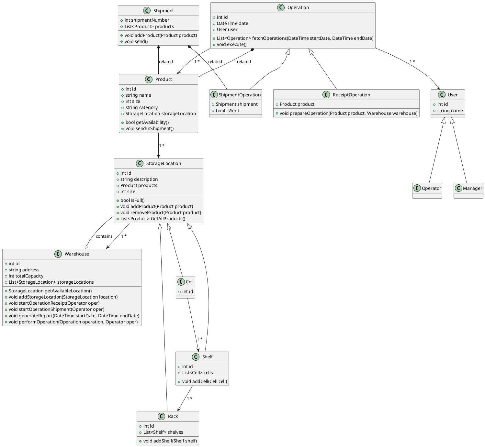

```plantuml
@startuml
' Определение классов
class Product {
    +int id
    +string name
    +int size
    +string category
    +StorageLocation storageLocation
    +bool getAvailability()
    +void sendInShipment()
}


class Warehouse {
    +int id
    +string address
    +int totalCapacity
    +List<StorageLocation> storageLocations
    +StorageLocation getAvailableLocation()
    +void addStorageLocation(StorageLocation location)
    +void startOperationReceipt(Operator oper)
    +void startOperationShipment(Operator oper)
    +void generateReport(DateTime startDate, DateTime endDate)
    +void performOperation(Operation operation, Operator oper)
}

class Operation {
    +int id
    +DateTime date
    +User user
    +List<Operation> fetchOperations(DateTime startDate, DateTime endDate)
    +void execute()
}

class ShipmentOperation{
    +Shipment shipment
    +bool isSent
}

class ReceiptOperation{
    +Product product
    +void prepareOperation(Product product, Warehouse warehouse)
}

class User {
    +int id
    +string name
}

class Manager {
}

class Operator {
}

class StorageLocation {
    +int id
    +string description
    +Product products
    +bool isFull()
    +int size
    +void addProduct(Product product)
    +void removeProduct(Product product)
    +List<Product> GetAllProducts()
}

class Rack{
    +int id
    +List<Shelf> shelves
    +void addShelf(Shelf shelf) 
}

class Shelf{
    +int id
    +List<Cell> cells
    +void addCell(Cell cell)
}

class Cell{
    +int id
}

class Shipment{
    +int shipmentNumber
    +List<Product> products
    +void addProduct(Product product)
    +void send()
}


' Связи
Product --> StorageLocation : "1 *"
StorageLocation --> Warehouse : "1 *"
Operation --> Product : "1 *"
Operation --> User : "1 *"
User <|-- Manager
User <|-- Operator

StorageLocation <|-- Rack
StorageLocation <|-- Shelf
StorageLocation <|-- Cell

Shelf --> Rack : "1 *"
Cell --> Shelf : "1 *"

Operation <|-- ShipmentOperation
Operation <|-- ReceiptOperation

' Агрегация и композиция
Warehouse o-- StorageLocation : "contains"
Operation *-- Product : "related"
Shipment *-- Product : "related"

Shipment *-- ShipmentOperation : "related"


@enduml

```